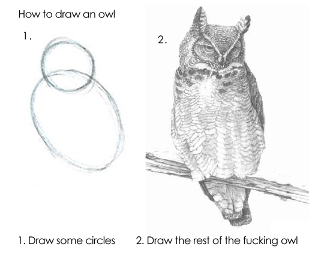

# `tidyowl`: Learning to draw the owl in the `tidyverse`

<!-- badges: start -->
<!-- badges: end -->

The goal of the `tidyowl` package is to provide some additional `learnr` tutorials as a path to learning how to do advanced things with the tidyverse, including:

- `tidyselect`
- `rowwise()/nest_by()`
- `purrr`

In other words, we're learning how to draw the f**king owl:



## Installation

You can install the github version with the following commands:

``` r
install.packages("remotes")
remotes::install_github("laderast/tidyowl")
```

## `learning_tidyselect`

`tidyselect` lets you programmatically select columns to do things with it. For example, you could select all of the columns in `penguins` that contains the string "bill". 

This tutorial also covers `across` and other column-wise operations.

### Learning Objectives for `learning_tidyselect`

- **Understand** how `tidyselect` helper functions (`contains()`, `all_of()`) work with `select()`.
- **Understand** how `where()` works with `select` and `.is*` functions
- **Learn** how to combine helpers with `c()` and find the *complement* using `-`
- **Apply** `across()` to work with `mutate()` to mutate multiple columns
- **Apply** `across()` with `summarize()` to summarize multiple columns

### Run this Tutorial

To run the learning tidyselect tutorial:

``` r
library(tidyowl)
learn_tidyselect()
```

If you don't have R installed on your machine, you can still run the tutorial by going to this mybinder.org link (it may take a little time to launch, be patient):

https://mybinder.org/v2/gh/laderast/tidyowl/master?urlpath=shiny/learning_tidyselect/

## `learning_rowwise` (in development)

Sometimes you need to calculate things row by row. In this tutorial, we cover the `rowwise()` workflow and use it with `mutate()`/`summarize()`. We also cover using `nest_by()` to make list-columns, and finally run multiple models on each row of a nested data frame.

### Learning Objectives

- **Learn** and **apply** `rowwise()` to produce row-by-row summaries
- **Understand** what `c_across()` does
- **Use** `nest_by()` to make list-columns
- **Access** the `data` in a list-column and **do** things with it.
- **Run** multiple statistical models on a list-column using `rowwise()`


### Run this Tutorial

To run the learning rowwise tutorial:

```r
library(tidyowl)
learn_rowwise()
```

If you don't have R installed, you can run the tutorial online by going to this mybinder.org link (it may take a little time to launch, be patient):

https://mybinder.org/v2/gh/laderast/tidyowl/master?urlpath=shiny/learning_rowwise/

### Acknowledgements

This tutorial was partially derived and inspired from the following links:

- https://jennybc.github.io/purrr-tutorial/ls13_list-columns.html
- https://r4ds.had.co.nz/many-models.html
- https://github.com/jennybc/row-oriented-workflows

Thanks to Rebecca Barter for suggesting that I flesh out the function descriptions some more. Thanks to Garrick Aden-Buie for his suggestion about `sum_mm` and `sum()`.


## Learning Lists

### Learning Objectives

- **Learn** about lists as a general purpose data structure
- **Learn** and **utilize** list properties 
- **Access** list elements using `$` and `[[]]`
- **Understand** the difference between homogeneous and heterogeneous lists
- **Use** `purrr::pluck()` to access list elements
- **Understand** how `data.frames()` are list-like
- **Understand** how to apply a function to a list using `purrr::map()`.

### Run This Tutorial

To run the learning lists tutorial:

```r
library(tidyowl)
learn_lists()
```

If you don't have R installed, you can run the tutorial online by going to this mybinder.org link (it may take a little time to launch, be patient):

https://mybinder.org/v2/gh/laderast/tidyowl/master?urlpath=shiny/learning_lists/


## Code of Conduct
  
Please note that the `tidyowl` project is released with a [Contributor Code of Conduct](https://contributor-covenant.org/version/2/0/CODE_OF_CONDUCT.html). By contributing to this project, you agree to abide by its terms.
