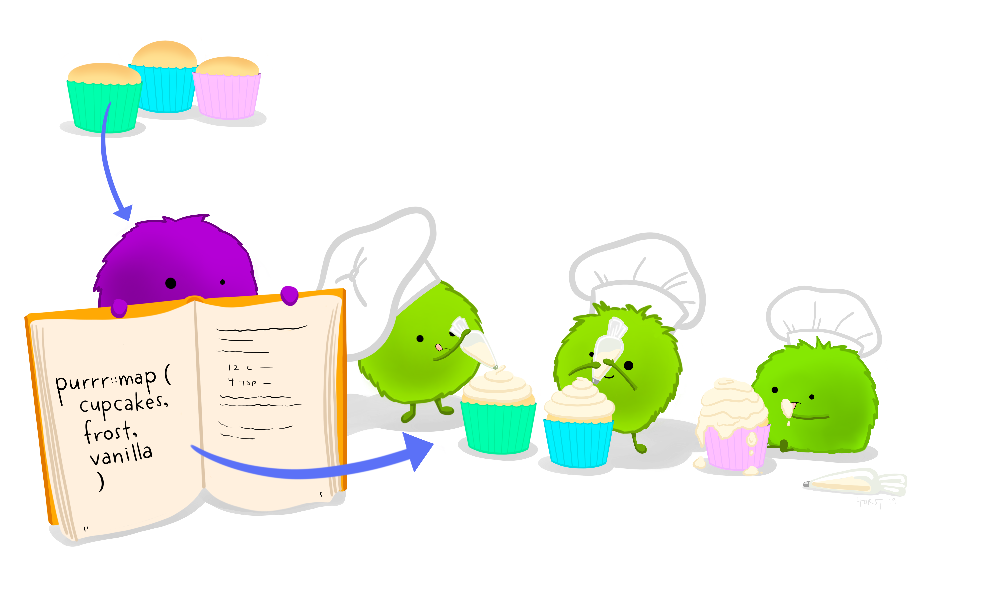

```{r setup, include=FALSE}
library(learnr)
knitr::opts_chunk$set(echo = FALSE)
library(tidyverse)
library(palmerpenguins)
data(penguins)
library(here)
```

# Learning Objectives

-   **Load** multiple files into a list
-   **Write** and **use** functions that can be applied (or `map`ped) to elements of a list
-   **Split** and **name** a list of `data.frame`s using `group_split()`
-   **Consolidate** elements of a list using `reduce()`.
-   **Write** a function that fails gracefully with `map()` using `possibly()`.

## The Basic Idea

For most of today, we're going to be taking a list of `data.frame`s and doing something with it.

We're going to explore two examples of using `map()`. This is the first example.

1. Make a list of file names using `list.files()`
2. Load the individual data frames into a list using `map()`
3. Write a function that works on one of the elements (a `data.frame`) in our list
4. Use `map()` to apply that function to each element in our list, return a a new list
5. If necessary, aggregate the final results in our final list into a `data.frame`.


The second example is:

1. Take a `data.frame`, and split it into smaller `data.frame`s in a list.
2. Write a function that works on one of the slots in the list. In this case, we'll be building a linear model.
3. Use `map()` to apply that function to each of the smaller `data.frame`s in our list
4. Get the linear model results out and aggregate our results using a `data.frame`


## Don't Repeat Yourself (DRY) - use functions!

If you do something in R once and have to do it again, it's probably best to think of how to do it well once, rather than cutting and pasting again.

For example, say that you have multiple files that have the same format and you want to load them all into R, and glue them into a single dataset.

Part of doing this is by using and writing *functions*. We can take code that we might have to write 10 times in a row, and package it in a way that we can use it multiple times.

```{r}
load_files <- function(path){
  out_frame <- readxl::read_excel(path, na="NA", sheet=1)
  out_frame <- janitor::clean_names(out_frame) %>%
    mutate(source=path)
  return(out_frame)
}
smoke1 <- load_files("data/smoke_1.xlsx")
smoke1
```

We will use `list.files()` to grab all of the `.xlsx` files in our `data/` directory.

We use the `pattern` argument to only grab the `.xlsx` files, and we need to use `full.names` argument to get the folder names as well.

```{r eval=FALSE}
files_to_load <- list.files(path=here("data/"), pattern = "xlsx", full.names = TRUE)
files_to_load
```

Note that these are absolute paths, but it's ok because we are in a project.

Now we can utilize our `load_files()` function that takes these file locations (or paths) as an argument for this function.

```{r eval=FALSE}
load_files(files_to_load[1])
```


# purrr::map()

```{r}
knitr::include_graphics("image/purrr_cat.png")
```

Enter the `purrr` package and `map()`.

`purrr::map()` lets us *apply* a function to each element of a list. It will always return a list with the number of elements that is the same as the list we input it with. Each slot of the returned list will contain the output of the functions applied to each element of the input list.

The way to read a `map()` statement is:

    `map(.x = files_to_load, .f = load_files)` 

> We're going to apply (map) our function 
>
> `load_files(),`
>
> to each element of the `list` called `files_to_load`.


```{r}
file_list <- purrr::map(.x = files_to_load, .f = load_files)
names(file_list) <- files_to_load
```

## Your Turn

What is the output of `purrr::map()` below? Is it a list? 

If it is a list, what is in each slot?

```{r}
file_list
```

```{r}

```

In other words, we're taking a list of something (`cupcakes`), applying a function (`frost()`) to each of them. Thus, we should get back three frosted cupcakes.

Where does the list come from? By default, `map()` returns the results of your functions to a list.


## Your Turn

Use `map()` to return the `length` of each of the elements in `my_list`. 

Remember that you don't want to put the `()` after the function name.

```{r}
my_list <- list(cat_names = c("Morris", "Julia"), 
                hedgehog_names = "Spiny", 
                dog_names = c("Rover", "Spot"))

my_lengths <- map(.x = my_list, .f = ------)
my_lengths
```

## Passing in multiple parameters

If you were using a function such as `mean`, you might want to specify an argument to it, such as `na.omit=TRUE`.

```{r}
my_list2 <- list(vec1 = c(10, 133, 1, NA), 
                 vec2 = c(11, 12, NA, 4), 
                 vec3 = c(1, 5, NA, 4)
                 )
map(my_list2, mean)
```

How do we do this? We can add any arguments that we need to by adding them after our function.

```{r}
map(my_list2, mean, na.rm=TRUE)
```


# `purrr::reduce()`

Once we've done something to our `data.frame`s in `my_list2`, how do we combine them?

We can use another command called `purrr::reduce()` that will take our list and combine them together, one element at a time.

The big difference between `map()` and `reduce()` has to do with what it returns:

> `map()` usually returns a list or data structure with the same number as its input;
>
> The goal of `reduce` is to take a list of items and return a single object.


```{r}
bound_file <- purrr::reduce(file_list, dplyr::bind_rows) 
dim(bound_file)
```

```{r}
bound_file
```

What is going on here? `bind_rows()` is first applied to the first two slots: file_list[[1]] and `file_list[[2]]`, producing a new data.frame. It then applies `bind_rows()` to our new data.frame and `file_list[[3]]`, until there are no data.frames left. 


## Your Turn

Use `purrr::reduce` to find the total number of rows in all three files using `sum`.

```{r}
file_rows <- purrr::map(file_list2, nrow)
purrr::reduce(file_rows, -----)
```


# Use Case 1: Building Tables for our File List

We might want to build a summary of each table that we've loaded in `file_list`.

```{r}
make_table <- function(df){
  df %>%
    janitor::tabyl(tumor_stage, vital_status)
}

make_table(file_list[[1]])
```

Running it on all of the elements in our list:

```{r}
out_list <- map(file_list, make_table)

out_list
```
### Your Turn

Show the table in `out_list` with the slot name of "/cloud/project/data//smoke_3.xlsx":

```{r}
out_list[[""]]
```


# Use Case 2: Taking our List of `data.frame`s, plotting them and running models

As a more complicated example, we will be taking `penguins`, and splitting it into a list with three slots: `Gentoo`, `Adelie`, and `Chinstrap`. 

We will then use `map()` to do two things.

1. Make a ggplot() for each slot
2. Run a linear model for each slot


## Chopping up a data frame by group: `group_split()`

We've seen `group_by`, which can group the rows of a data.frame by a factor. We can physically split the data.frame into a list by our groups.

Sometimes it is easier to split the data.frame into a list and work from there.

Here we're using `group_split()` - which separates your data out into a list by your grouping variables.

```{r}
penguins_grouped <- penguins %>%
  group_by(species)

penguins_by_species <- group_split(penguins_grouped, .keep=TRUE)

penguins_by_species
```

This is almost good. We need to name each slot as well. We can grab that using the `group_keys()` function 

```{r}
species_names <- unlist(group_keys(penguins_grouped))
species_names

names(penguins_by_species) <- species_names

penguins_by_species
```

Now, let's do something with each of the `data.frame`s in our list. 

```{r}
build_scatterplot <- function(df){
  species <- df$species[1]
  
  ggplot(df) +
    aes(x = bill_depth_mm, y=bill_length_mm) +
    geom_point() +
    geom_smooth(method="lm") +
    labs(title=species)
}

build_scatterplot(penguins_by_species[["Gentoo"]])
```

We've confirmed that our function works on one of our slots, so now we can `map()` it to our other slots!

```{r}
plot_list <- map(penguins_by_species, build_scatterplot)
plot_list
```

Let's do the same thing for modeling. We're going to write a function called `run_model()` that will build a linear model. 

We want to model `bill_length_mm` as a function of `bill_depth_mm` in our linear model.

```{r}
run_model <- function(df){
  species <- df$species[1]
  out_model <- lm(bill_length_mm ~ bill_depth_mm, data=df)
  out_results <- broom::tidy(out_model) %>% mutate(species=species) %>%
    relocate(species)
  return(out_results)
}

run_model(penguins_by_species[["Gentoo"]])
```


## Your Turn

Use `map()` to apply `run_model()` on `penguins_by_species`. What does it contain?

Remember that you don't want to use parentheses `()` after `run_model`.

```{r}
model_list <- map(penguins_by_species, --------)

model_list
```

Try using `map_df()` to do the same thing to `penguins_by_species()` - what did it return?

```{r}
model_df <- map_df(penguins_by_species, run_model)

model_df
```


# `map_*`: Return a specific data type

There are a lot of `map_` functions, as you can see if you type in `map_:`

-   `map_int()` - returns an integer vector
  - your function that you `map` should return an integer
-   `map_lgl()` - function should return a logical vector
  - your function should return a logical
-   `map_dbl()` - function should return a double (decimal) vector
  - your function should return a `double`
-   `map_df`() - function should return a `data.frame`

The main difference between these is that they are *strict*: if you function doesn't return the desired data type, it will return an error.

If we know what data type we want to return, we can use one of the `map_*` functions. We know that the lengths should return `integer`, so let's use `map_int().`

Check the class of `lengths2` - is it a `list` or a `vector`?


```{r}
lengths2 <- map_int(my_list, length)
lengths2
```

One of the most important variants is `map_df()` - it will return a single data.frame, instead of a list. So, it can be handy, and help you skip using a `reduce()` step.

```{r}
file_list <- purrr::map_df(files_to_load, load_files)
file_list
```

Why do this? It's good coding practice, because you're guaranteeing that you will return something in that format.


# Failing Gracefully: `possibly()`

We might have a list of objects where one of the elements is *faulty*. Maybe there's no data in it, only a big `NA`. That is what `possibly()` is for. Let's add an element to `files_to_load` that isn't a file path:

```{r}
files_to_load3 <- c("blah", files_to_load)
files_to_load3
```

If we `map` `load_files()` on this vector, we're going to get an error, because there is no file called `blah`:

```{r}
test <- map(files_to_load3, load_files)
```

Arrgh, it stopped at the first element! How can we fail gracefully?

We need to use `possibly()` to *wrap* around our function. We first need to define new function called `load_files_possibly()`. 

The second argument (`otherwise`) is what the function will return if there's an error. In our case, we'll return a NULL.

```{r}
load_files_possibly <- possibly(.f = load_files, otherwise = NULL)

load_files_possibly(files_to_load3[1])
```

You can see that it returns a `NULL` value rather than returning an error.

Now we can use `load_files_safely()` on our list:

```{r}
file_list <- map(files_to_load3, load_files_possibly)
file_list
```

The nice thing about returning `NULL` instead of an error here is that we can continue to work. That is, the `NULL` value won't affect our `reduce()` or `map_df()`:

```{r}
out_frame <- reduce(file_list, bind_rows)

out_frame
```

```{r}
out_frame <- map_df(files_to_load3, load_files_possibly)
out_frame
```


# Extra: Anonymous Functions to save typing

One thing about when you look at other peoples' `purrr` code is that it can be super confusing. There's all sorts of weird notation, such as `.` and `~`. Depending on what your function does, and what is in your `list`.

`purrr`/`dplyr` has a shorthand way of defining functions, called *anonymous* functions, using the *formula* notation:

    ~mean(.$bill_length_mm, na.rm=TRUE)

is the same as

    function(x) {
       mean(x$bill_length_mm, na.rm=TRUE)
       }

The `~` basically takes the place of `function(x)` and the `.` takes the place of `x`. 

We're not naming the function, which is why it's an *anonymous* function.

Let's use the `group_split()` function to split our `data.frame` into a list by species:

```{r}
library(palmerpenguins)
data(penguins)
penguins_by_species <- penguins %>%
  group_by(species) %>%
  group_split()
```


Notice that in the above we use `.`, which is a way to refer to what's in the current element of a list. In our case, we are using `.` to refer to the `data.frame` in the current slot position:

```{r}
names(penguins_by_species)
penguins_by_species
```

```{r}
purrr::map(.x = penguins_by_species, 
          .f =  ~nrow(.))
```

The nice thing about anonymous functions is that you can pass in additional parameters within the function, rather than placing them outside of the function.


### Your Turn

What does the following code do? How did we supply the `na.rm` argument?

```{r}
purrr::map(penguins_by_species, 
             ~mean(.$bill_depth_mm, na.rm  = TRUE))
```


# Where Next?

Using and understanding `purrr` functions opens up something really powerful: parallel computing. You can have multiple cores of a machine running iterations of your list using the `furrr` (short for future purrr) package.

Learning more about functions and vectorization will help you to reduce the number of mistakes in analysis. 


## Acknowledgments

Thanks so much to Rebecca Barter, whose treatment of `purrr` is one of the best I've ever seen. Very clear. http://www.rebeccabarter.com/blog/2019-08-19_purrr/ 

Illustrations are from Hadley Wickham's talk ["The Joy of Functional Programming (for Data Science)."](https://learning.acm.org/techtalks/functionalprogramming)
